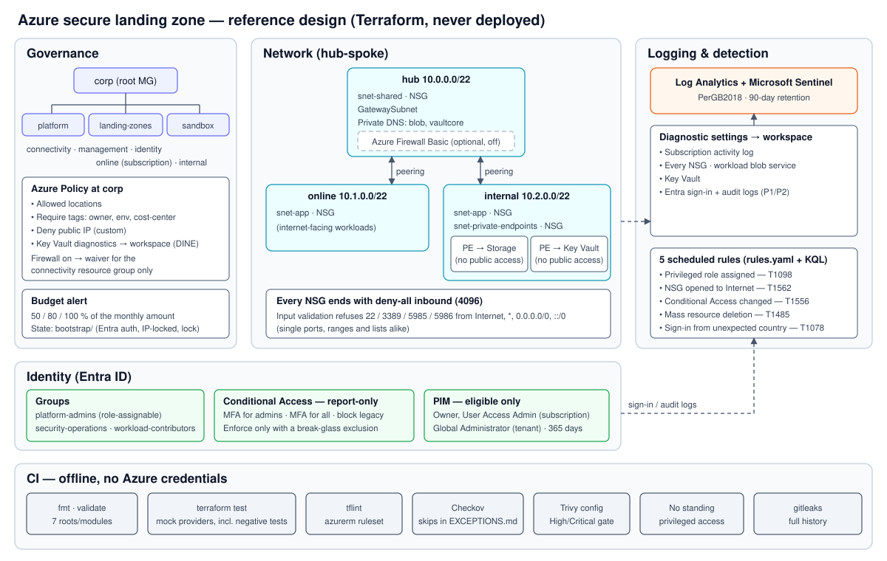

# Lab 05 — Azure secure landing zone with Terraform

[](https://github.com/santorest/lab-05-azure-landing-zone/actions/workflows/ci.yml)

Terraform landing zone for a fictional organisation ("Corp"): management groups and Azure Policy guardrails,
a hub-spoke network with default-deny NSGs and private endpoints, Log Analytics and Microsoft Sentinel with five
ATT&CK-mapped detections, report-only Conditional Access and PIM-eligible admin access.

> **Reference design — validated in CI, never deployed.** Every module is tested offline with mock providers
> and scanned by tflint, Checkov and Trivy; nothing has been applied to Azure. What that does and doesn't prove
> is in the [write-up](WRITEUP.md#6-what-was-verified-and-what-wasnt). To deploy it, follow
> [docs/deploy.md](docs/deploy.md).

**Category:** Cloud & Modern Security · **Status:** reference design



## Repository layout
```
bootstrap/                 remote-state storage account (applied once, local state)
landing-zone/              root module: composes the modules; backend.hcl.example, terraform.tfvars.example
modules/governance/        management groups, policy assignments, budget
modules/network/           hub-spoke VNets, NSGs, private DNS, workload storage + private endpoint
modules/firewall/          optional Azure Firewall Basic and spoke routing (off by default)
modules/logging/           Log Analytics, Sentinel, Key Vault + private endpoint, diagnostic settings, detections
modules/identity/          Entra groups, Conditional Access (report-only), PIM eligibility
detections/                rules.yaml + one .kql query per Sentinel rule
scripts/                   test-all.sh (local CI mirror), check-standing-access.sh
security/EXCEPTIONS.md     every scanner skip, with its reason
docs/                      deploy, teardown and cost, posture measurement, design decisions
```
Each module has its tests in `tests/*.tftest.hcl` next to it.

## Run the checks locally
Needs Terraform ≥ 1.9 (CI uses 1.16.4); tflint and Checkov are optional. No Azure account is needed.
```bash
bash scripts/test-all.sh                                   # fmt, init, validate and test in every root/module
tflint --init && tflint --recursive --config "$PWD/.tflint.hcl"
checkov --directory . --framework terraform --quiet --compact
```

## CI
`.github/workflows/ci.yml` runs on every push and pull request: `terraform fmt`, then `init -backend=false`,
`validate` and `test` for all seven roots and modules; tflint with the azurerm ruleset; Checkov and Trivy
(config scan) with SARIF uploads; a check that no Terraform grants standing privileged access; and gitleaks over
the full history. There are no Azure credentials in this repository or its CI.

## Documentation
- [WRITEUP.md](WRITEUP.md) / [WRITEUP.es.md](WRITEUP.es.md): the full write-up.
- [docs/design-decisions.md](docs/design-decisions.md): choices, trade-offs and the address plan.
- [docs/deploy.md](docs/deploy.md), [docs/teardown-and-cost.md](docs/teardown-and-cost.md),
  [docs/measure-posture.md](docs/measure-posture.md).

## License
MIT. See [LICENSE](LICENSE).
