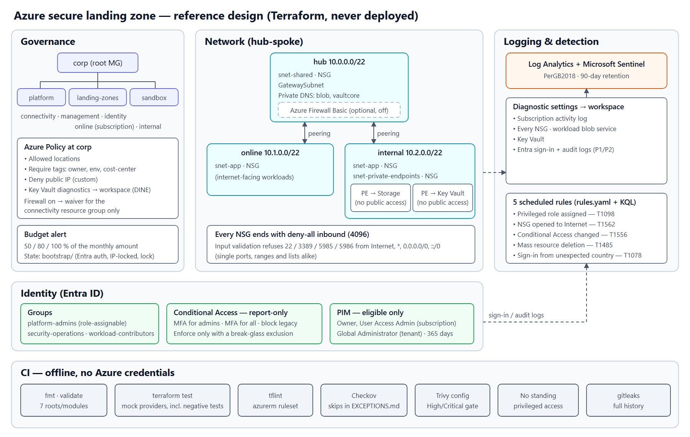

# Azure Secure Landing Zone with Terraform

> **TL;DR:** A Terraform landing zone for a fictional organisation ("Corp") that closes the usual gaps of a
> fresh Azure subscription: management groups with policy guardrails, a hub-spoke network where nothing
> exposes a management port and data services have no public endpoint, Log Analytics and Sentinel with five
> detections, and admin access that exists only through PIM. Everything is tested offline in CI with mock
> providers, including tests that prove the code **refuses** unsafe input.
> **Deliverable: Terraform code, tested and scanned in CI, never deployed to Azure.**

| | |
|---|---|
| **Role played** | Cloud security engineer building the first subscription for a small organisation |
| **Environment** | One Azure subscription + Entra tenant (designed for), GitHub Actions (used) |
| **Tools** | Terraform (azurerm 4.x, azuread 3.x), Azure Policy, Microsoft Sentinel/KQL, Entra ID, tflint, Checkov, Trivy |
| **Deliverable** | 5 modules + root + state bootstrap, 52 offline tests, 5 detections, CI pipeline, deploy/teardown guides |

---

## 1. Problem

A new Azure subscription starts permissive: any region, any public IP, admins with standing Owner rights, no
central logs, and nothing stopping a well-meaning engineer from opening RDP to the Internet. For a small
organisation, the realistic threats are:

- **Exposed management ports:** SSH/RDP/WinRM reachable from the Internet, brute-forced within hours.
- **Public data endpoints:** storage accounts and key vaults reachable from anywhere.
- **Standing privileged access:** a stolen admin session is immediately Owner of everything.
- **No evidence:** activity, sign-in and resource logs never collected, so nothing can be investigated.
- **Sprawl and cost:** resources in unexpected regions, untagged, with no budget alert.

The goal: encode the guardrails once, as code, so every subscription starts closed.

## 2. Architecture

| Area | What the code creates |
|---|---|
| Governance | `corp` → `platform` (connectivity, management, identity), `landing-zones` (online, internal), `sandbox`; policy at `corp`: allowed locations, three required tags, deny public IP (custom), Key Vault diagnostics (DeployIfNotExists); monthly budget with 50/80/100 % alerts |
| Network | Hub + two spokes, peered; every subnet that can take one has an NSG ending in deny-all inbound; workload storage and Key Vault only through private endpoints with private DNS zones; optional Azure Firewall Basic (off) |
| Logging | Log Analytics (90 days), Sentinel, diagnostic settings for the activity log, every NSG, blob storage, Key Vault and Entra sign-in/audit logs; five scheduled analytics rules |
| Identity | Three Entra groups; Conditional Access (MFA for admins, MFA for all, block legacy auth) in report-only mode; Owner, User Access Administrator and Global Administrator as PIM-eligible only |
| State | Separate bootstrap: storage account with Entra-only auth, versioning, soft delete, access from one IP and a CanNotDelete lock |

## 3. Build

### Governance
Policy is assigned at the root management group so every subscription inherits it. The built-in definition
IDs and parameter names were checked against Microsoft's `Azure/azure-policy` repository before use. The
custom *deny public IP* policy has one designed exception: when the firewall is enabled, its resource group
gets a waiver. It's a resource-group exemption, not a management-group one, because a single subscription
lives under one management group only.

### Network
The `network` module's input validation is the heart of it. Any extra NSG rule that allows 22, 3389, 5985 or
5986 inbound from `Internet`, `*`, `Any`, `0.0.0.0/0` or `::/0` is refused at plan time, whether the port is
written alone, inside a range (`20-25`, `1-65535`), inside a list, or as `*`. Rules must target a subnet that
exists and has an NSG, with unique priorities from 100 to 4000 (4096 is reserved for the deny-all rule).

### Logging and detections
Detections are data: `detections/rules.yaml` holds each rule's metadata and ATT&CK mapping, and each query
is a `.kql` file. The logging module fails the plan if a query is orphaned or missing, or a rule has no
tactic.

| Rule | Source | ATT&CK |
|---|---|---|
| Privileged Azure role assigned (Owner / User Access Administrator) | AzureActivity | T1098 Account Manipulation |
| NSG rule allows inbound traffic from the Internet | AzureActivity | T1562 Impair Defenses |
| Conditional Access policy created, changed or deleted | AuditLogs | T1556 Modify Authentication Process |
| Mass resource deletion by one caller (≥ 10 in 15 min) | AzureActivity | T1485 Data Destruction |
| Successful sign-in from a country outside the allow-list | SigninLogs | T1078 Valid Accounts |

### Identity
Conditional Access starts in report-only mode, and the module refuses `ca_state = "enabled"` unless a
break-glass group is given (and excluded from every policy). Owner, User Access Administrator and Global
Administrator are PIM **eligible** assignments, never active ones. The two Azure roles' eligibility expires after
365 days; the Global Administrator eligibility has no expiry in Terraform (the azuread resource can't set one), so
its duration comes from the tenant's PIM role settings. A CI step fails if Terraform grants standing access to a
privileged role, whether by role name in any case or by role ID.

## 4. How it's validated

No Azure credentials exist anywhere in the repository or its CI. Every push and pull request runs:

| Job | What it checks |
|---|---|
| fmt | `terraform fmt -check -recursive` |
| terraform (×7) | `init -backend=false`, `validate` and `terraform test` in `bootstrap/`, `landing-zone/` and each module |
| tflint | azurerm ruleset (invalid SKUs, regions, attributes) plus Terraform best practices |
| checkov | Terraform misconfiguration checks; SARIF to code scanning |
| trivy-config | Terraform misconfiguration checks, gate on High/Critical; SARIF to code scanning |
| policy-checks | No standing privileged access (and the check proves itself against a known-bad file) |
| secrets | gitleaks over the full git history |

`terraform test` uses **mock providers**: the real azurerm/azuread schemas and argument validation, but no
API calls. Positive tests assert the security properties of what would be created. Negative tests
(`expect_failures`) assert what the code refuses:

| The code refuses… | Test |
|---|---|
| RDP/SSH/WinRM from the Internet, in any of six spellings | `network`: 6 tests |
| NSG rules on a missing or NSG-exempt subnet, duplicate or out-of-range priorities | `network`: 4 tests |
| A landing zone without a hub | `network` |
| Empty allowed-locations list, unknown placement, non-GUID subscription | `governance` |
| A budget that doesn't start on the 1st of a month, or has no contacts | `governance` |
| Enforcing Conditional Access without break glass; a misspelt CA state; a break-glass ID that is empty or not a GUID | `identity` |
| Detection drift: an orphan query, a missing query file, a rule without tactics (one fixture each) | `logging` |
| Firewall enabled without its subnets | `firewall` |
| A deployer IP that is a range, private or reserved | `bootstrap` |
| Root tags missing or empty `owner` / `env` / `cost-center`; a `location` outside `allowed_locations` | `landing-zone` |

## 5. Results

The only results in this lab are test and scan outputs; there is no deployment to report on.

| Check | Result |
|---|---|
| `terraform test`, local run 2026-09-30 after the final-review fixes (Terraform 1.16.2) | **52 passed, 0 failed** (bootstrap 3, governance 9, network 15, firewall 3, logging 9, identity 8, landing-zone 5) |
| Checkov 3.3.20, local run | **50 passed, 0 failed, 11 skipped, 0 parsing errors**. Every skip is justified in `security/EXCEPTIONS.md` |
| tflint 0.64.0 + azurerm ruleset 0.32.0, local run | **0 issues** (one rule ignored on 4 resources, justified) |
| Demo PR [#9](https://github.com/santorest/lab-05-azure-landing-zone/pull/9): RDP from the Internet ([details](docs/demo-prs.md)) | **Refused**: `terraform (landing-zone)` failed on the management-port validation; the other 12 jobs passed, **including Checkov and Trivy, which did not flag the rule** |
| CI on GitHub Actions, [run 36728843729](https://github.com/santorest/lab-05-azure-landing-zone/actions/runs/36728843729) (commit `49d9f7f`, after the final-review fixes, Terraform 1.16.4) | **13/13 jobs passed**: the same 52 tests; Checkov 50 passed / 0 failed / 11 skipped, 0 parsing errors; Trivy 0 High/Critical (its Low/Medium storage findings ignored with reasons); tflint clean; standing-access check caught all 5 known-bad fixtures and passed the repo; gitleaks: no leaks |

## 6. What was verified and what wasn't

**Verified** (by tests and scanners, offline):
- The Terraform is syntactically valid against the real azurerm 4.81 / azuread 3.10 schemas, including
  argument validation. The mocks caught real mistakes this way: an Azure Firewall's subnets must be named
  `AzureFirewallSubnet` and `AzureFirewallManagementSubnet`.
- The security properties asserted in section 4: what gets created, where policy is assigned, what's private,
  what's report-only or eligible-only, and every refusal in the negative tests.
- Scanner baselines: no failed Checkov or tflint checks outside documented exceptions.

**Not verified** (only a real `plan`/`apply` in Azure would show):
- That Azure accepts every resource at apply time (API-side validation, name availability, quotas, regional
  SKU availability, management-group propagation delays).
- That the policies actually deny what they should, and that the DeployIfNotExists remediation works.
- Conditional Access behaviour, and PIM activation (both need Entra ID P1/P2).
- That the KQL queries parse and the detections fire on real events.
- Defender for Cloud secure score before/after: [docs/measure-posture.md](docs/measure-posture.md) is the
  procedure, and no score is claimed.
- Real cost. The figures in [docs/teardown-and-cost.md](docs/teardown-and-cost.md) are list-price estimates.

## 7. Design decisions and lessons

Full reasoning is in [docs/design-decisions.md](docs/design-decisions.md). In short: NSGs over a firewall
(cost), report-only Conditional Access with break glass (lock-out risk), eligible-only admin roles, a
resource-group policy exemption, partial backend configuration, and detections as data.

Lessons from building it:
- **Mock providers aren't schema-free.** They still run the real provider's argument validation, so mocked IDs
  must look like real Azure resource IDs. The upside: they caught the firewall subnet naming rule offline.
- **Plan mode can't see generated values.** Assertions on IDs fail in `command = plan`, so positive tests use
  `command = apply` against the mocks (still no API calls) and negative tests use `plan`.
- **A scanner can fail silently.** Checkov reported "Parsing errors: 1" and skipped the governance module
  entirely, because it couldn't parse unquoted `if`/`then` keys inside `jsonencode`. Quoting them made the module
  scannable, and CI now fails on any Checkov parsing error.
- **Identical mock IDs make assertions pass trivially.** The final review found two assertions (which group gets
  PIM eligibility, which DNS zone the Key Vault uses) that would have passed with the wrong wiring, because
  every mocked group or zone had the same ID. They now use distinct overridden IDs, and each was checked by
  breaking the code on purpose and watching the test fail.
- **A scanner finding exposed a real design gap.** The Key Vault had public access disabled and no private
  endpoint, so nothing could reach it. Checkov's CKV2_AZURE_32 pointed at it, and the fix was an endpoint, not
  a skip.
- **Terraform's `&&` doesn't short-circuit.** A validation like "is an IP *and* not private" raised an evaluation
  error on malformed input instead of the intended message, until it was wrapped in `try(…, false)`.
- **Static scanners miss what flows through variables.** In the RDP demo PR the unsafe rule came from a variable
  default through a module's `for_each`; Checkov and Trivy both passed it. The input validation (and its tests)
  refused it. Scanners are the second line, not the control.
- **CI earned its keep on day one.** Dependabot's first run proposed azurerm 5.x for every module; the tests failed
  on its breaking schema changes (private DNS zone links take different arguments). Provider majors are now held
  back in `dependabot.yml` and will be a deliberate migration.
- **`prevent_destroy` fights testing.** It can't vary per environment and blocks `terraform test`'s own
  teardown. The state account uses a CanNotDelete management lock instead.

## 8. Reproduce it yourself

- Clone: `git clone https://github.com/santorest/lab-05-azure-landing-zone.git`
- Run every check offline: `bash scripts/test-all.sh` (Terraform ≥ 1.9, no Azure account).
- Deploy: [docs/deploy.md](docs/deploy.md); tear down: [docs/teardown-and-cost.md](docs/teardown-and-cost.md).
- Download bundle: from the portfolio site (SHA-256 shown next to the download).

## 9. Mapping

| Area | Framework | How this project addresses it |
|---|---|---|
| Resource organization; Governance | Microsoft Cloud Adoption Framework (landing zone design areas) | Management-group hierarchy, policy at the root, tags, budget |
| Network topology and connectivity; Security | Microsoft Cloud Adoption Framework | Hub-spoke, default-deny NSGs, private endpoints, optional firewall |
| Identity and access management | Microsoft Cloud Adoption Framework | Groups, Conditional Access, PIM eligibility, break glass |
| Management; Platform automation and DevOps | Microsoft Cloud Adoption Framework | Central logging, Sentinel, IaC with tested modules and CI gates |
| Identity, Storage accounts, Logging and monitoring, Networking, Key Vault sections | CIS Microsoft Azure Foundations Benchmark | MFA/CA and PIM; private storage with TLS 1.2 and no shared keys; activity-log and resource diagnostics; no management ports from the Internet; Key Vault with RBAC, purge protection, no public access |
| T1098, T1562, T1556, T1485, T1078 | MITRE ATT&CK | One Sentinel rule each (section 3) |

---

*Fictional organisation, example IDs only (all-zero GUIDs). Nothing in this repository was deployed, and no
real organization's data, tenant or configuration is included.*
